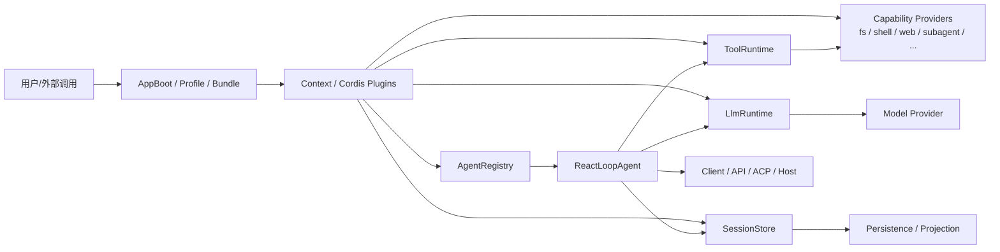

# DeepSeek Harness 架构分析

本文基于仓库现状整理 DeepSeek Harness 的系统结构、模块职责、模块间关系，以及核心运行链路。该系统不是传统单体应用，而是一个以 Cordis 为基础的“插件编排型 Agent Harness”：几乎所有能力都通过插件注册到统一的 `Context`，再由启动脚本、bundle、profile、session、agent、tool、LLM、capability seam 组合成运行时。

## 1. 总体架构结论

DeepSeek Harness 的核心设计原则可以概括为：

- 插件化：所有模块都通过 Cordis 的 `Context` + `Service` + 事件机制参与运行。
- 事件驱动：session log、agent lifecycle、LLM streaming、tool execution 都通过事件扩展点接入。
- 能力分层：service definition / provider / consumer 形成可替换能力缝隙。
- 会话为中心：session log 是模型可见上下文的唯一事实来源，模型输出与工具活动都最终落回 session events。
- 可组合运行环境：通过 bundle + profile + cordis.patch.yml 组合出 `web`、`headless` 等不同启动形态。

因此，从架构上看，DeepSeek Harness 是一个“具备 agent loop、tool runtime、session lifecycle、capability seams 的可扩展 agent runtime”，而不是单一的 LLM 客户端。

## 2. 模块分层

### 2.1 引导与配置层

这一层负责把环境、配置、profile、bundle 组合成运行时。关键模块包括：

- `packages/boot/app-boot`：统一启动入口，负责加载 `.env`、解析配置、解析 profile、应用 patch layer、构建 Cordis Loader。
- `packages/boot/cmdline`：命令行入口，暴露 `dsh --profile ...` 等运行参数。
- `packages/bundle/base`、`packages/bundle/headless`、`packages/bundle/web-app`：按 profile 组合不同能力包。

这层的核心职责是：

- 确定启动配置
- 选择 profile 和 bundle 顺序
- 解析用户 patch
- 挂载基础插件树
- 生成最终 `Context`

从代码可以看出，启动不依赖“单一主程序”而是通过 profile 与 bundle 的顺序叠加构建出来：

- bundle 按 order 应用于空 entry list
- profile 自身 patch 追加到最后
- home 层和 `--patch` overlays 再叠加

这使得整个产品具有很强的可替换和可扩展性。

### 2.2 核心运行时层

这是系统的中枢，直接决定 Agent 的工作模式和能力闭环：

- `packages/core/session`
  - 负责 append-only session log
  - 维护 in-memory session store
  - 提供 `session/event`、`session/flush` 等事件
  - 通过 log 还原 LLM 历史，保证模型可见上下文由 durable session 事件重建

- `packages/core/agent`
  - 定义 `Agent`、`AgentRegistry`、`AgentHandle` 等接口
  - 负责创建/恢复/销毁 agent
  - 处理 agent-scoped registration 和事件

- `packages/core/agent-loop`
  - 提供默认 concrete loop 实现：`ReactLoopAgent`
  - 负责驱动 turn/step 处理、inbox 管理、agent lifecycle、异常控制

- `packages/core/tools`
  - 定义 tool runtime, tool registry, schema validation, pre/execute/post hooks
  - 把 model 想调用的工具映射成结构化执行管道

- `packages/core/system-prompt`
  - 汇总 prompt sections 和 tool schema，构造一次模型请求的完整 prompt

这几部分一起构成了 Agent 运行核心：

“session log -> prompt assembly -> LLM request -> tool calls -> session append -> next turn”

### 2.3 能力封装层（Capability Seam）

DeepSeek Harness 的能力高度模块化：每个能力都遵循 Service Definition / Provider / Consumer 的分层模式。

主要能力包包括：

- `llm/`: LLM provider seam
- `subprocess/`: process runtime seam
- `shell/`: shell execution capability
- `terminal/`: PTY / persistent terminal capability
- `fs/`: filesystem capability
- `web/`: web search / fetch capability
- `subagent/`: 子代理能力
- `workflow/`: workflow engine capability
- `context/`: request context capability
- `settings/`: setting capability
- `credentials/`: credentials and auth capability
- `interaction/`: approval / ask-user / permissions
- `guard/`: loop security/timeouts
- `todo/`, `plan/`, `skill/`, `compaction/` 等

本质上，每个 package 既可能是定义接口的 seam，也可能是 provider，也可能是 tool consumer；其职责依赖挂载方式，而不是强耦合到固定实现。

### 2.4 接入与应用层

- `packages/api/`：远程 BFF + Typert RPC gateway
- `packages/host/`：web GUI host half
- `packages/client/`：浏览器端 UI runtime + slot system + session/workspace UI
- `packages/sdk/`：JSON-RPC / TypeScript client / server side SDK
- `packages/acp/`：Agent Client Protocol server
- `packages/examples/`：示例配置和 demo bundles

这一层是“用户可感知 UI / 外部协议 / 远程接入”层，通常依赖底层的 agent/session/tool runtime，不直接破坏核心 runtime 设计。

## 3. 模块间关系

### 3.1 运行时关系总图



### 3.2 启动链路

1. `dsh --profile web` 进入命令行启动器
2. `app-boot` 读取 `.env` 与 profile manifest
3. `bundle` 和 `cordis.patch.yml` 按顺序合成 Loader entries
4. Loader 生成 Cordis `Context`
5. `ctx.agents` + `ctx.sessions` + `ctx.llm` + `ctx.tools` 等 service 被挂载
6. configured agent 被创建/恢复
7. agent loop 开始驱动 turn

### 3.3 Agent turn 链路

`docs/architecture.md` 已明确给出 turn/step 生命周期开销，简化如下：

```text
user input -> agent inbox -> turn/start
-> claim next step
-> assemble prompt sections + tool schemas
-> agent/pre-step
-> step/start
-> derive model history from session log
-> llm/stream
-> assistant/chunk* -> assistant/message
-> tool/call* -> tools/pre-execute -> tools/execute -> tools/post-execute -> tool/result*
-> step/end
-> next step or turn end
```

关键点：

- `session log` 是上下文事实的唯一来源
- prompt 不是完全自由拼装，而是由 `session` + `system-prompt` + `tool` schema 汇总形成
- model 输出可能触发很多工具调用，工具调用通过 `tools/*` event waterfall 进入 policy 和执行阶段
- 所有新产生的事实会写回 `session/event`

### 3.4 能力替换关系

DeepSeek Harness 的架构强调“能力 seam”，也就是：

- 业务代码依赖 `Service Definition`
- 实现由 provider 提供
- 具体行为由 consumer 调用

例如：

- `ctx.llm` 允许替换不同基础模型 adapter
- `ctx.fs` 可切换本地、沙箱、远端实现
- `ctx.subprocess` 可切换本地进程树、E2B 或其他环境
- `ctx.shell` / `ctx.terminals` 可接不同执行后端

这意味着：

- 不需要修改 core loop
- 不需要直接写死 provider
- 只需要在 bundle/profile 中挂入不同 provider plugin

## 4. 关键模块与类的角色关系

### 4.1 `Context`：统一运行容器

`Context` 是整个 Cordis 运行世界的统一容器，类似“全局依赖注入容器 + 事件总线 + 插件注册表”。

- 每个 package 在 `declare module '@deepseek-ai/cordis'` 中扩展 `Context`
- 每种能力都通过 `ctx.<key>` 提供服务
- 事件服务通过 `ctx.on()`, `ctx.effect()`, `ctx.waterfall()` 注册

这是整个系统的根结构：没有“核心代码直接调用一切”，而是依赖多插件挂载到同一个 `Context` 上。

### 4.2 `SessionStore` / `Session`：会话和事件源

`core/session` 中的 `SessionStore` 负责：

- 管理 session 生命周期
- 维护 append-only events
- 提供 log projection / model history / runtime state
- 对外触发 `session/event` 与 `session/flush`

`Session` 对象本身包含 header、event stream 和 runtime deduced metadata；从设计上看，它不是数据库记录，而是“log-sourced session object”。

它与 Agent 的关系非常关键：

- Agent 读取 `Session` 事件生成 prompt
- Agent 执行工具与模型输出后再次写入 `Session`
- 这使得“不论重启、恢复还是 replay，最核心的上下文都由 session log 重建”

### 4.3 `AgentRegistry` / `Agent`：agent 生命周期管理

`core/agent` 定义了：

- `AgentRegistry`：注册/获取/销毁 agent
- `Agent`：抽象 agent contract
- `AgentHandle`：创建后可销毁的 agent 持有对象

`AgentRegistry` 的职责不是运行模型，而是：

- 维护 agent id 与 session 的绑定
- 提供 create/resume/dispose 流程
- 保证 agent 处于 scoped context 中

### 4.4 `ReactLoopAgent`：默认循环驱动器

这是系统的真正执行车轮。`ReactLoopAgent` 类的关键职责包括：

- 维护 `Inbox`：用户输入入队，按 turn/step 取出
- 维护 `phase`（idle/running/maintenance）：调度生命周期
- 创建 `Scope` 与 `RuntimeContextProjection`
- `wakeDriver()` 负责启动驱动循环
- `turn()` 负责一次 turn 的处理
- 调用 `llm/stream` 发送请求
- 解析工具调用，委托 `executeToolCalls()` 执行
- 生成/更新 session events

从类职责看，它是 Agent runtime 的核心执行单元，调用关系如下：

```text
ReactLoopAgent
  ├─ uses Inbox (user input queue)
  ├─ reads Session events
  ├─ builds PromptAssembly
  ├─ emits agent/* events
  ├─ calls LlmRuntime.stream(...)
  ├─ calls ToolRuntime.execute(...)
  └─ appends session/event / turn/end / step/end
```

### 4.5 `LlmRuntime`：模型调用入口

`packages/llm/llm` 中的 `LlmRuntime` 是 provider seam 的根入口：

- 提供统一的 `llm/stream` waterfall
- 对 adapter 进行注册、路由和重试策略处理
- 建立 `PreparedLlmCall`，保证一个请求在完成前保持稳定配置
- 允许插件在预处理、请求执行、后处理阶段拦截/替换/扩展

它的关键特征是：

- provider backends 与 loop 代码是解耦的
- `llm/stream` 允许 waterfall listeners 接管模型调用过程
- 适合挂接 retry，metrics，routing，provider fallback 等能力

### 4.6 `ToolRuntime`：工具执行总线

`core/tools` 中的 `ToolRuntime` 是模型工具的运行时总线：

- 管理 tool schema / registration / validation
- 处理 `tools/pre-execute` / `tools/execute` / `tools/post-execute`
- 统一封装 JSON 参数校验和 tool call 结果
- 对不同工具类型（read/write/search/web/shell/code）统一调度

工具执行链路非常关键：

```text
model tool call
  -> ToolRuntime.validate
  -> tools/pre-execute
  -> tools/execute
  -> tool body implementation
  -> tools/post-execute
  -> tool result event + session append
```

它也是系统中最典型的“事件拦截型扩展点”。

### 4.7 `AppBoot` / `Profile`：配置树和启动树

`packages/boot/app-boot` 里 `Profile` / `resolveProfileDir` / `initProfile` 负责：

- 寻找 profile 目录
- 读取 `package.json` 的 `dsh.profile.bundles`
- 解析 bundle 的 patch 文件
- 递归或顺序应用 patch layer
- 形成最终 Cordis entry list

这层决定“系统如何组装”，是整个 product 可插拔架构的起点。

## 5. 模块调用关系（按功能链）

下面是最重要的真实调用链：

```text
User input
  -> CLI / apps / ACP / API
  -> AppBoot load profile & patch
  -> Context build
  -> AgentRegistry.create/resume
  -> ReactLoopAgent
      -> Inbox.claim pending messages
      -> SessionStore.read events
      -> Prompt assembly (system-prompt + tools schema)
      -> LlmRuntime.stream(generateOptions)
      -> receive assistant chunks
      -> ToolRuntime.execute(tool calls)
      -> provider implementation (shell / fs / web / subagent / ...)
      -> append tool result / assistant message / turn end to session
```

这条链路反映了 DeepSeek Harness 的核心设计：

- 启动是配置拼装
- 运行是 agent loop 驱动
- 上下文是 session log
- 能力是可替换 seam
- 执行是 tool + provider 统一管道

## 6. 总结

如果用一句话概括 DeepSeek Harness 的架构：

“它是一个基于 Cordis 的插件式 Agent Runtime，围绕会话事件日志组织上下文，围绕 agent loop 驱动模型与工具交互，围绕 capability seam 提供 shell、filesystem、LLM、web、subagent 等可替换能力，并通过 bundle/profile 把不同部署形态编织成一个统一运行时。”

它的几个关键特征是：

- 没有单一“中心控制器”，而是 `Context` + plugin registry 驱动
- `Session` 是真实事实来源，模型可见输入必须可从 session log 重建
- `AgentLoop` 是真实执行引擎
- `ToolRuntime` 是模型动作的统一出口
- `profile/bundle` 让系统可以在 CLI / Web / ACP / remote 中共用核心 runtime

这一架构使 DeepSeek Harness 能同时满足：

- 强扩展性
- 高内聚的 agent loop
- 多种部署方式（headless/web/ACP）
- 严格的可替换 capability 设计

## 7. 建议的阅读顺序

如果想继续深入理解代码，可按这个顺序阅读：

1. `docs/architecture.md`：总体架构与 turn 流程
2. `packages/core/agent-loop/src/agent.ts`：默认 loop 实现
3. `packages/core/session/src/index.ts`：session log 与 events
4. `packages/core/tools/src/index.ts`：tool pipeline
5. `packages/llm/llm/src/index.ts`：LLM runtime 和 provider seam
6. `packages/boot/app-boot/src/profile.ts`：profile / bundle composition
7. `packages/client/README.md` 和 `packages/host/README.md`：web GUI 分层
8. `packages/api/README.md`：远程 API / BFF 架构

这样能从“宏观设计”逐步到“核心实现细节”。
