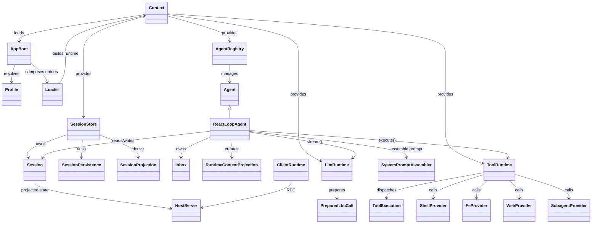
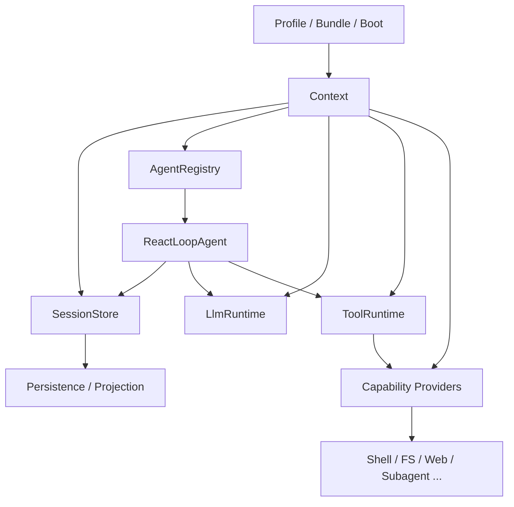

# DeepSeek Harness 类图与调用关系

本文给出一组精简但有代表性的类图，聚焦 `boot -> session -> agent -> llm -> tools -> capability providers` 这条核心运行链路。

## 1. 总体类图



## 2. 关键类职责说明

### 2.1 `AppBoot` / `Profile`

`AppBoot` 负责从命令行/profile/bundle 解析出最终加载树，`Profile` 负责读取 bundle 顺序和 patch layer，并最终交给 Loader 生成出 `Context`。

它控制的是“系统怎么启动”，而不是“怎么跑一轮 Agent”。

### 2.2 `SessionStore` / `Session`

`SessionStore` 负责保存 event-sourced session log；`Session` 维护当前会话的完整事件流。

- Agent 每轮都从 `Session` 里恢复上下文
- model-visible 事实都必须写回 `session/event`
- `SessionProjection` 和 `SessionPersistence` 从 event 流中派生状态和持久化结果

### 2.3 `AgentRegistry` / `ReactLoopAgent`

`AgentRegistry` 是入口级别的 agent 管理器；`ReactLoopAgent` 是默认真实执行器。

关键调用关系：

```text
AgentRegistry.create() -> ReactLoopAgent constructor
ReactLoopAgent.send() -> Inbox.splice()
ReactLoopAgent.wakeDriver() -> kick()
ReactLoopAgent.turn() -> deriveMessages() -> LlmRuntime.stream()
ReactLoopAgent.turn() -> executeToolCalls() -> ToolRuntime
ReactLoopAgent.turn() -> SessionStore.append(...)
```

### 2.4 `LlmRuntime` / `PreparedLlmCall`

`LlmRuntime` 提供统一的模型调用入口；`PreparedLlmCall` 封装已解析的 adapter config 与 retry policy。

```text
ReactLoopAgent -> LlmRuntime.stream(options)
LlmRuntime -> PreparedLlmCall.stream(options)
PreparedLlmCall -> provider adapter -> stream chunks
```

### 2.5 `ToolRuntime` / `ToolExecution`

`ToolRuntime` 负责工具注册、校验和执行，而 `ToolExecution` 保存单次工具调用的上下文：

- 调用参数
- 调用者 agent
- 允许/拒绝/审批策略
- 执行信号与生命周期

```text
ReactLoopAgent -> ToolRuntime.execute(exec)
ToolRuntime -> tools/pre-execute
ToolRuntime -> tool provider implementation
ToolRuntime -> tools/post-execute
ToolRuntime -> tool result event
```

## 3. 运行时时序图

```mermaid
sequenceDiagram
  actor User
  participant Boot as AppBoot/Profile
  participant Context as Cordis Context
  participant Sessions as SessionStore
  participant Agents as AgentRegistry
  participant Loop as ReactLoopAgent
  participant LLM as LlmRuntime
  participant Tools as ToolRuntime
  participant Provider as Capability Provider
  participant Persist as SessionPersistence

  User->>Boot: 启动 dsh --profile
  Boot->>Context: compose bundles/profile/patch
  Context->>Sessions: mount session service
  Context->>Agents: mount agent service
  Context->>LLM: mount llm service
  Context->>Tools: mount tool runtime

  Agents->>Loop: create agent for session
  Loop->>Sessions: read log / derive history
  Loop->>LLM: stream(prompt + tool schema)
  LLM-->>Loop: assistant chunks

  alt model emits tool call
    Loop->>Tools: execute tool call
    Tools->>Provider: call fs/shell/web/subagent
    Provider-->>Tools: tool result
    Tools-->>Loop: normalized result
  end

  Loop->>Sessions: append assistant/tool events
  Sessions->>Persist: flush durable log
```

## 4. 架构上的“类调用关系”总结

从实现架构看，最关键的调用链不是经典 OOP 的“单个类互相 new”，而是通过 `Context` 和事件总线实现的插件调用：

```text
AppBoot
  -> Loader
  -> Context
  -> SessionStore
  -> AgentRegistry
  -> ReactLoopAgent
      -> Inbox
      -> SessionStore (read log)
      -> LlmRuntime.stream
      -> ToolRuntime.execute
      -> Capability Providers
      -> SessionStore.append
```

这说明：

- 结构上是 service 注册和事件扩展，而不是传统 `new A().methodB()` 的直线调用
- 运行时类关系更偏“依赖注入 + 事件订阅 + Pipeline”
- 真正的控制流集中在 `ReactLoopAgent` 和 `ToolRuntime`
- `SessionStore` 是事实源，`LlmRuntime` 是推理入口，`ToolRuntime` 是能力出口

## 5. 关键设计抽象

### 5.1 `Context` = 运行世界

所有服务都是挂到同一个 `Context` 上，不属于单一模块内的私有对象。它是整个系统中最关键的抽象。

### 5.2 `Session` = 真相源

任何“模型可见内容”都必须可重建自 session log；这是 DeepSeek Harness 设计中非常重要的约束。

### 5.3 `ReactLoopAgent` = 执行引擎

`turn` / `step` / `inbox` / `phase` 是运行器的关键状态。它负责统一调度模型请求和工具执行。

### 5.4 `ToolRuntime` = 行动总线

工具调用既可能是 shell、文件系统、web、subagent，也可能是自定义工具；所有这些都适配到同一条执行流水线中。

## 6. 一图理解



这张图基本勾勒出 DeepSeek Harness 的“系统骨架”，也是理解模块关系的最简视角。
