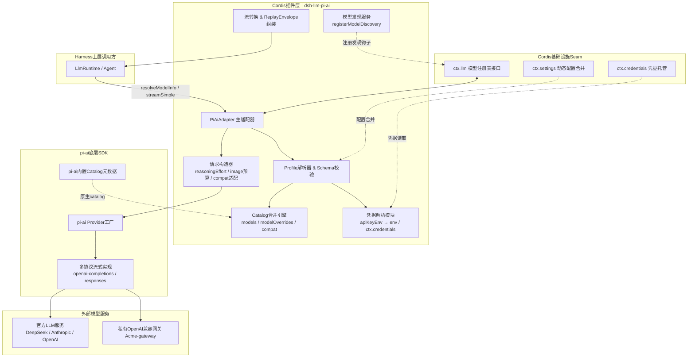
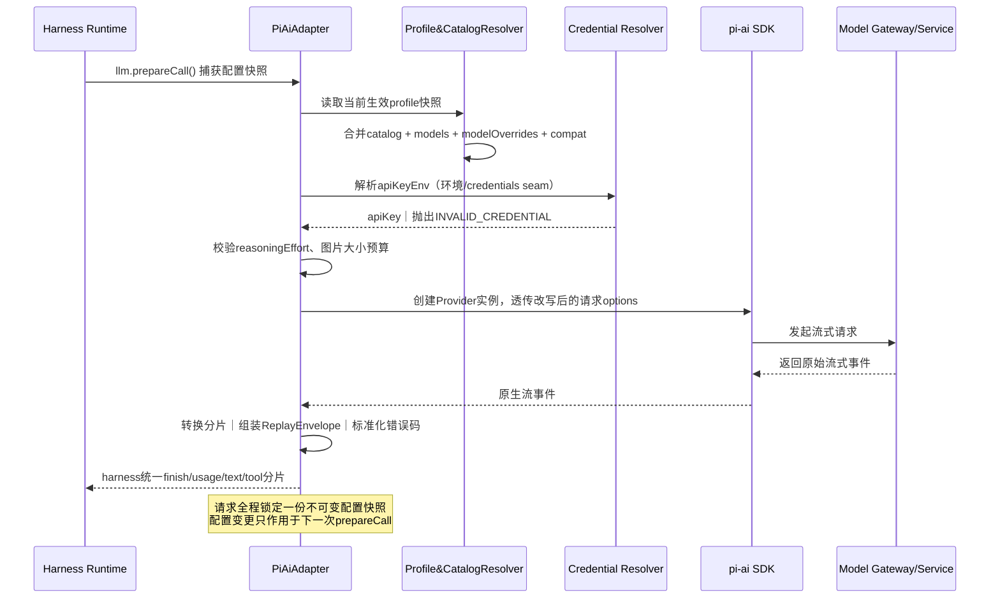

# @deepseek‑ai/dsh‑llm‑pi‑ai 架构总结文档
## 文档概述
`dsh‑llm‑pi‑ai` 是基于 `@earendil‑works/pi‑ai` 实现的 **Cordis 插件式多厂商LLM统一适配器（Harness Seam）**。
核心价值：**通过配置完成多模型网关接入、协议适配、模型能力裁剪/覆盖，无需修改业务代码；支持动态热配置、凭据托管、流式请求回放、错误标准化**。
- 定位：Harness LLM 抽象层的实现插件
- 依赖底座：`pi‑ai`（底层模型SDK、协议实现、原生Catalog）
- 运行框架：Cordis（插件生命周期、Settings、Credentials Seam）

## 一、核心概念梳理
1. **Provider Route（提供方路由）**
    字典key作为路由ID，每一条路由对应一份独立`profile`配置；分为两大类：
    - **Catalog路由**：继承pi‑ai内置端点、协议、模型目录，配置仅做增量覆盖
    - **手工声明路由**（自定义网关）：pi‑ai无原生定义，完整声明`api/baseURL/models/compat`
2. **Profile**：单路由完整配置集合（凭据引用、超时、图片限制、重试策略、模型改写规则）
3. **Catalog / Model元数据**
    - `models[]`：**完全替换**该路由原始模型集合
    - `modelOverrides`：**局部修改**单个模型字段，其余catalog保持不变
4. **Compat协议兼容层**：修正OpenAI兼容网关的字段差异（思考格式、developer角色、token字段名）
5. **动态配置**：Cordis Settings分层合并（基础cordis.yml + 用户可编辑llm‑pi‑ai命名空间），**无需重启生效**
6. **Discovery端点探测**：配置编辑态的模型列表查询（仅OpenAI兼容接口）
7. **ReplayEnvelope回放信封**：保存原生流式块签名，会话恢复时保真还原厂商原生协议状态

## 二、包导出与内部边界
### 对外导出（公共API）
1. Cordis插件声明（id:`llm`，包名`@deepseek‑ai/dsh‑llm‑pi‑ai`）
2. `PiAiAdapter` 适配器主类
3. `supportedProtocols()`：返回配置可声明的协议白名单（排除AWS Bedrock/Vertex/Azure这类特殊鉴权协议）

### 内部私有逻辑（不对外暴露）
- profile配置解析与schema校验
- catalog物化、模型字段继承/覆盖计算
- provider实例工厂构造
- 请求/流式响应转换、回放块组装
- 错误码标准化映射

## 三、分层架构（Mermaid）


## 四、完整数据流时序图（单次LLM请求）


## 五、五大核心模块详细职责
### 1. 配置解析 & Catalog合并引擎
1. 配置分层：`cordis.yml(base)` ➜ `llm‑pi‑ai settings(user)`，字典按键合并
2. 模型合并规则
    - `models:[]`：**完全替换**路由catalog，仅保留列表内模型，字段继承pi‑ai
    - `modelOverrides`：仅修改指定id模型，其余catalog完整保留
    - 字段优先级：**模型compat > 路由compat > pi‑ai原生catalog > 默认兜底值**
3. 兜底参数：`defaultContextWindow / defaultMaxTokens / defaultInput`
4. 严格校验：非法配置写入直接抛出`settings‑rejected`，保留上一份可用配置

### 2. 凭据管理模块
- `apiKeyEnv`：环境变量引用；优先读取`ctx.credentials`，回落至进程环境变量
- 仅**完全不配置凭据**的路由交给pi‑ai原生环境自动发现
- 密钥前置校验，去除空白字符，避免下游非语义HTTP报错；错误码：`MISSING_CREDENTIAL / INVALID_CREDENTIAL`
- 敏感凭据**不会序列化存入配置文件**

### 3. 协议兼容（Compat）适配层
用于兼容自定义OpenAI网关的协议差异，支持在**路由级别 / 模型级别**配置：
- `thinkingFormat`：deepseek风格思考块格式
- `supportsDeveloperRole`：是否支持developer角色消息
- `maxTokensField`：区分`max_tokens` / `max_completion_tokens`
- 校验规则：协议不支持的compat字段直接解析失败

### 4. 模型发现服务（Discovery）
1. 仅用于**配置编辑预览**，不持久化模型列表；`settings.yaml`才是唯一真值源
2. Catalog路由：直接读取本地pi‑ai元数据，**不联网请求**
3. 自定义网关路由：仅探测OpenAI `/v1/models`接口
4. 探测时优先使用草稿页面输入的临时密钥做认证测试
5. 失败错误码：`DISCOVERY_UNSUPPORTED / DISCOVERY_FAILED`

### 5. 流式转换 & 回放持久化模块
1. pi‑ai原始事件 → Harness统一分片（text / tool_call / usage / finish）
2. 错误标准化：`CONTEXT_WINDOW_EXCEEDED / QUOTA / RATE_LIMIT / EMPTY_RESPONSE`
3. `ReplayEnvelope`：保存每个流式块签名，会话恢复时还原厂商原生状态
4. 回放降级策略：版本不兼容、路由变更时自动转为通用文本消息，不中断请求

## 六、重试、超时与图片预算管控
1. pi‑ai SDK重试**强制关闭（maxRetries=0）**；重试逻辑上移至Agent层`dsh‑llm‑retry`
2. `retryPolicy`在profile定义，默认normal模式，最多重试5次
3. 图片约束：
    - `requestImagePixelBudget`：单张图片像素上限
    - `requestImageMaxBytes`：原始base64前字节上限
    - `maxRequestImageBytes`：整条请求base64总载荷；超出后淘汰最早图片替换为占位文本

## 七、注册原子性与生命周期规则
1. 插件注册路由具备原子性；与其它适配器路由冲突时**加载失败，旧路由继续提供服务**
2. 配置变更生成全新不可变快照；**正在执行的旧请求不受配置更新干扰**
3. 适配器支持休眠模式：providers为空，等待settings动态注入路由

## 八、错误码体系（Harness标准化）
| 错误码 | 含义 |
|---|---|
| `MISSING_CREDENTIAL` | apiKeyEnv无法解析到凭据 |
| `INVALID_CREDENTIAL` | 密钥格式非法 |
| `UNKNOWN_MODEL` | 请求模型不在当前路由允许集合 |
| `UNSUPPORTED_REASONING_EFFORT` | 推理档位该模型不支持 |
| `TIMEOUT` | 流式空闲超时 |
| `INVALID_REPLAY_STATE` | 回放信封版本/签名不匹配，降级回放 |
| `DISCOVERY_UNSUPPORTED` | 当前协议不支持模型探测接口 |

## 九、已知限制（Important Caveats）
1. Settings字典合并**无法删除顶层配置key，只能覆盖**；`models`数组整体替换是唯一删除方案
2. Catalog不会自动远程刷新模型列表；模型变更必须人工编辑yaml配置
3. 单路由仅支持**单一协议**，一条路由不能混合Responses + Chat‑Completions模型
4. `GenerateOptions.stop` 不被支持，直接拒绝该参数
5. 登录凭据仅保存在进程内存，进程销毁后丢失
6. 模态（image/text）仅做配置声明，**运行时不会主动校验网关真实能力**

## 十、插件依赖关系总结
```
Harness LLM Runtime
        ↓
@deepseek‑ai/dsh‑llm‑pi‑ai（Cordis插件｜配置合并、适配层、回放）
        ↓
@earendil‑works/pi‑ai（底层协议SDK、内置模型Catalog）
        ↓
远端LLM服务 / OpenAI兼容网关
```

# 文件保存建议
将全部内容复制保存为 `dsh‑llm‑pi‑ai‑architecture.md`，在支持Mermaid渲染的编辑器（VSCode + Mermaid / Typora / GitHub）查看完整架构图。

如果你需要，我可以再输出一份：
1. PlantUML版本架构图
2. 接口清单文档（公共API + 内部契约）
3. 配置模板最佳实践yaml样例

需要补充哪一部分？