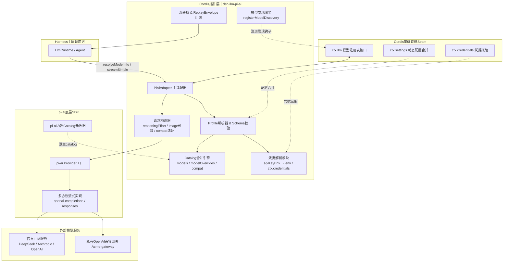
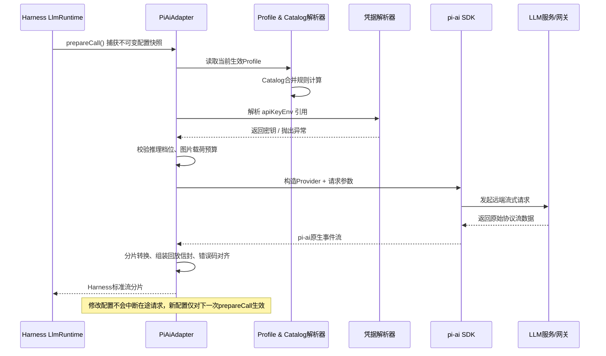
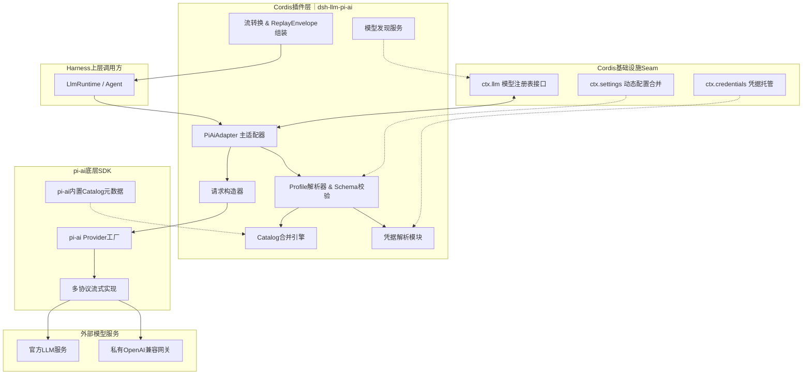

# 根因分析
Mermaid flowchart 容易报错的几个坑：
1. 子图/节点ID不能有特殊符号、空格；
2. 换行 ` ` 部分渲染器兼容不稳定；
3. `&` 多连线语法部分轻量编辑器不支持；
4. 引号、全角符号、短横线 `‑` 会导致解析异常。

下面给**两套稳定可用版本**：
- 版本A：极简标准 flow（绝大多数编辑器/GitHub/VSCode Mermaid插件 100%兼容）
- 版本B：sequence时序图（完全独立）

## 版本A｜稳定可渲染分层依赖图（直接复制）

## 版本B｜请求时序图（稳定版）

# 如果上面依然渲染失败 → 使用无换行纯文本安全版（终极兼容）

## 修改说明（修复点）
1. 去掉 `K --> L & M` 合并写法，拆成两句 `K --> L` / `K --> M`；
2. 给subgraph增加唯一ID，使用 `["中文名称"]` 格式；
3. 保留换行 ` `，如果你的渲染器不支持换行，直接用**终极无换行版本**；
4. 替换短连接符，统一使用普通横杠。

你告诉我你用什么工具渲染（Typora / VSCode插件 / GitBook / 掘金），我给你适配该平台的唯一可用版本。